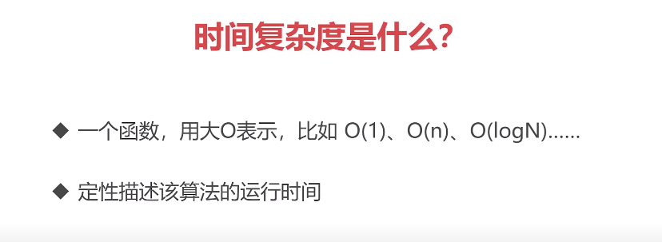
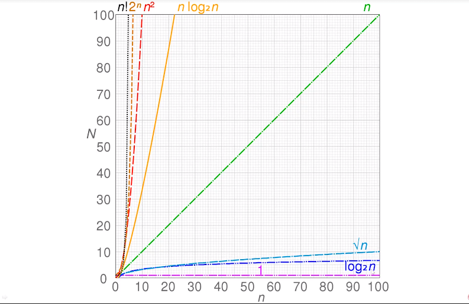
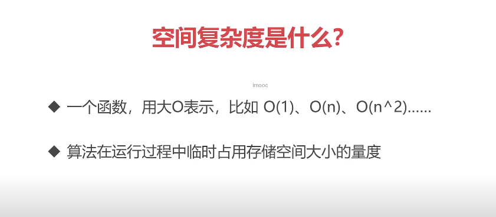

# 算法复杂度

## 1. 时间复杂度





O(1)
```javascript
let i = 0
i += 1
```

O(n)
```javascript
for (let i = 0; i < n; i += 1) {
  console.log(i)
}
```

O(1) + O(n) = O(n)
```javascript
let i = 0
i += 1
for (let j = 0; j < n; j += 1) {
  console.log(j)
}
```

O(n) * O(n) = O(n^2)
```javascript
for (let i = 0; i < n; i += 1) {
  for (let j = 0; j < n; j+= 1) {
    console.log(i, j)
  }
}
```

O(logN)
```javascript
let i = 1
while (i < n) {
  console.log(i)
  i *= 2
}
```


## 2. 空间复杂度



O(1)
```javascript
let i = 0
i += 1
```

O(n)
```javascript
const list = []
for (let i = 0; i < n; i += 1) {
  list.push(i)
}
```

O(n^2)
```javascript
const matrix = []
for (let i = 0; i < n; i += 1) {
  matrix.push([])
  for (let j = 0; j < n; j += 1) {
    matrix[i].push(j)
  }
}
```
