# 链表

- [链表的概念](#链表的概念)
- [原型链](#原型链)
- [技术要点](#技术要点)

## 链表的概念

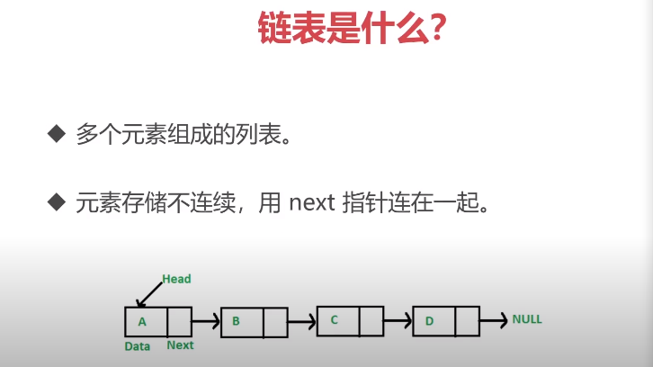

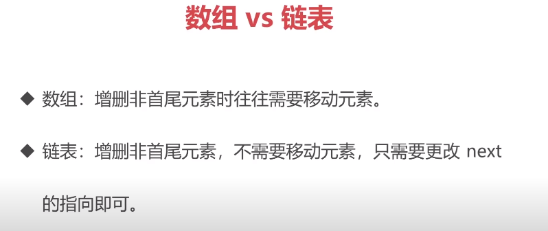

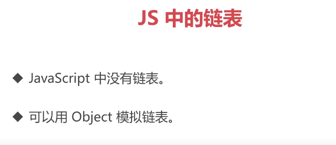

[`LeetCode：237.删除链表中的节点`](https://leetcode-cn.com/problems/delete-node-in-a-linked-list/)

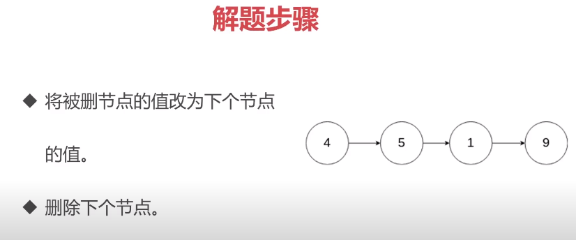

[`LeetCode：206. 反转链表`](https://leetcode-cn.com/problems/reverse-linked-list/)

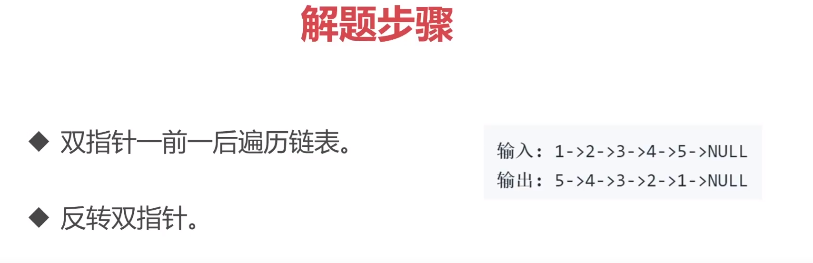

[`LeetCode：2. 两数相加`](https://leetcode-cn.com/problems/add-two-numbers/)

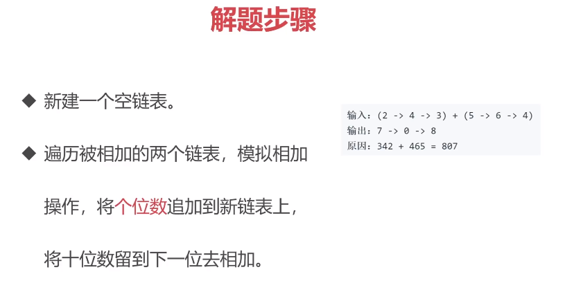

[`LeetCode: 83. 删除排序链表中的重复元素`](https://leetcode-cn.com/problems/remove-duplicates-from-sorted-list/)

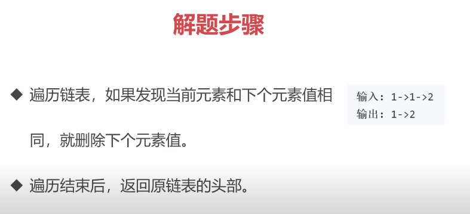

[`LeetCode: 141. 环形链表`](https://leetcode-cn.com/problems/linked-list-cycle/)

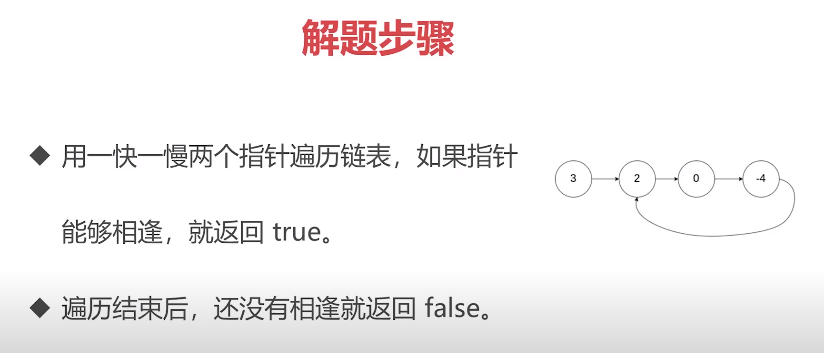

## 原型链

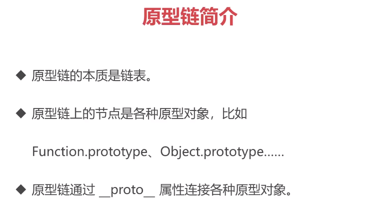

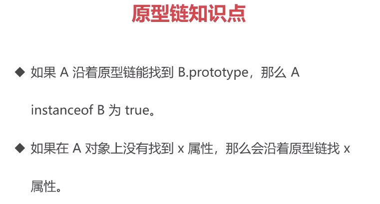

`instanceof 的原理，并用代码实现`

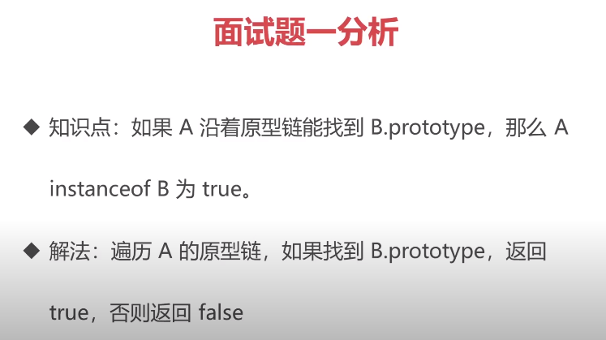

## 技术要点

> - 链表里的元素存储不是连续的，之间通过next链接。
> 
> - JavaScript中没有链表，但可以用Object模拟链表。
> 
> - 链表常用操作：修改next、遍历链表。
> 
> - JS中的原型链也是一个链表。
> 
> - 使用链表指针可以获取JSON的节点值
