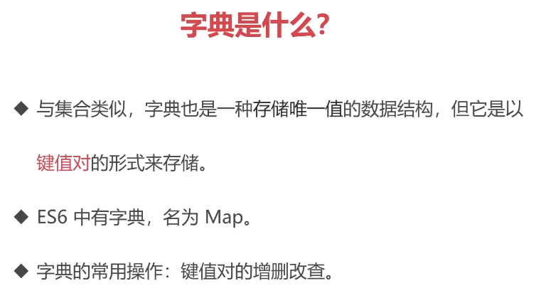
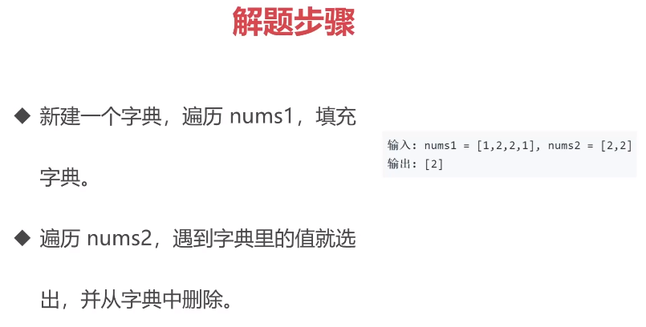
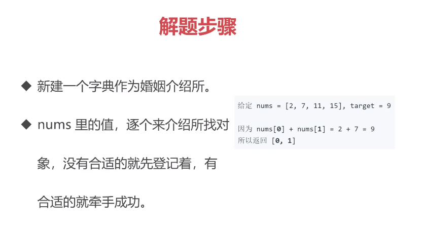
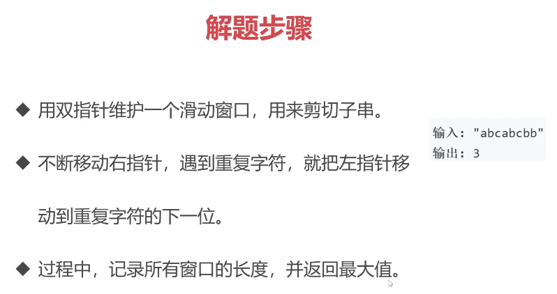
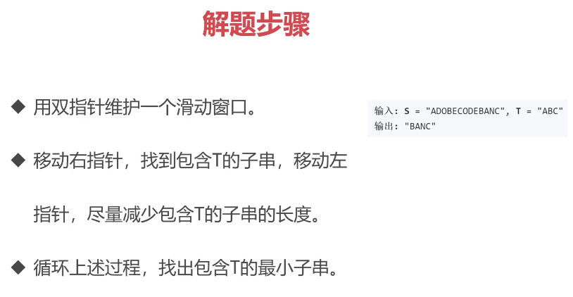

# 字典

[`LeetCode: 349. 两个数组的交集`](https://leetcode-cn.com/problems/intersection-of-two-arrays/)

[`LeetCode: 1. 两数之和`](https://leetcode-cn.com/problems/two-sum/)

[`LeetCode: 3. 无重复字符的最长子串`](https://leetcode-cn.com/problems/longest-substring-without-repeating-characters/)

[`LeetCode: 76. 最小覆盖子串`](https://leetcode-cn.com/problems/minimum-window-substring/)

